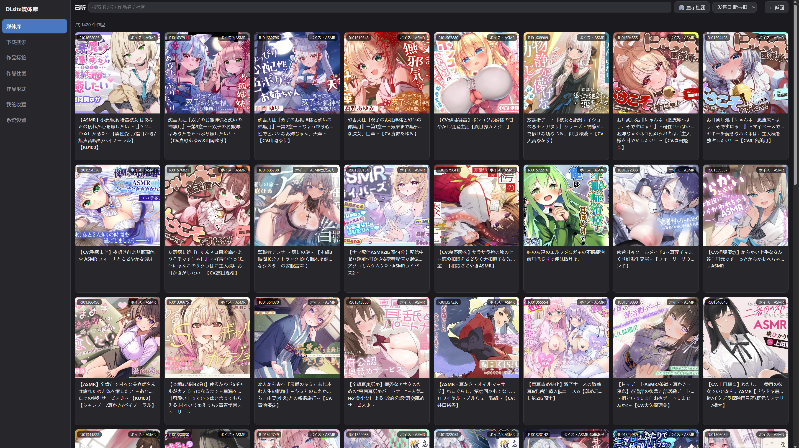
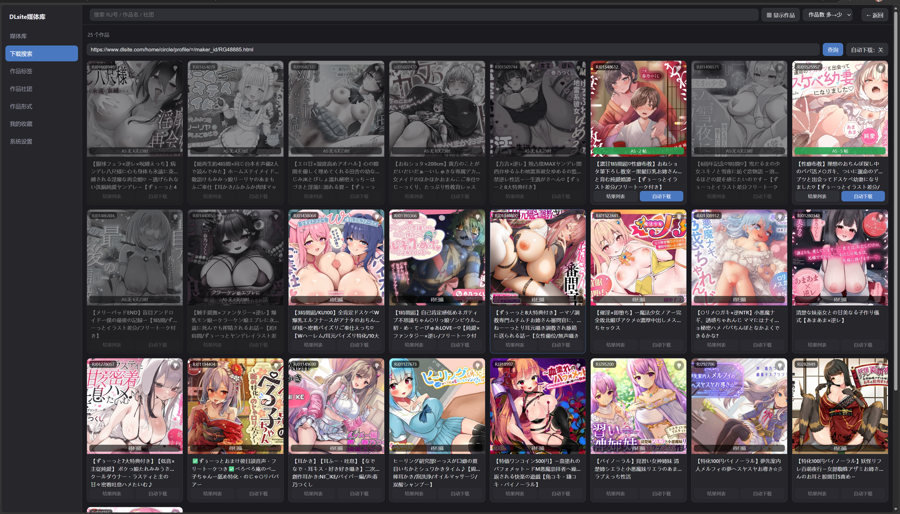
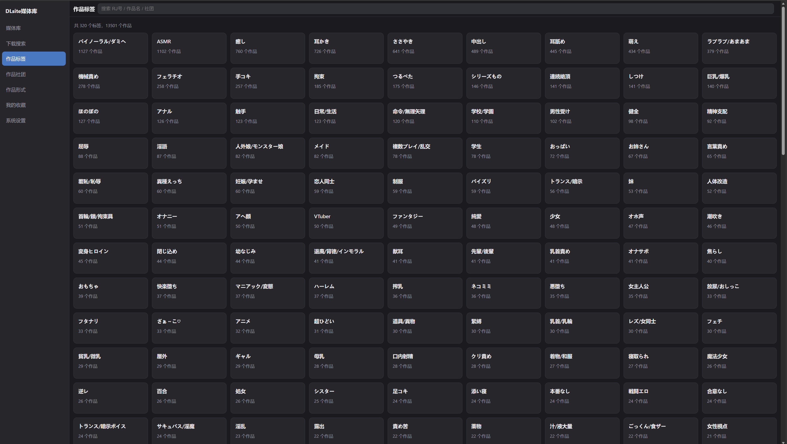
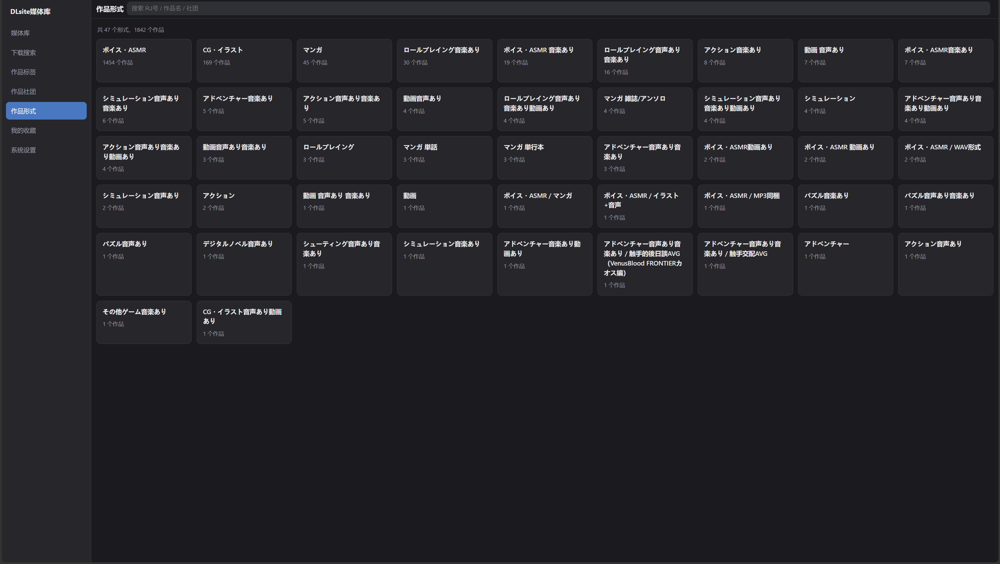

# DLsiteMedia

**DLsite 作品（RJ 番号）の取得・管理・閲覧・再生**を行う Windows デスクトップツール（WPF / .NET 10 / C#）です。

2 つのダウンロードソースを統合し、メディアライブラリ、ダウンロードキュー、組み込みプレイヤー（動画 + 音声）、および任意の LAN 向け Web アクセスサーバーを内蔵しています。

- **Anime-sharing フォーラム**（[https://www.anime-sharing.com/](https://www.anime-sharing.com/)）——フォーラムの投稿からアップローダー（ネットストレージ）リンクを抽出し、**Debrid-Link リレーサービス経由で解決してダウンロード**します。
- **asmr.one 公式 API**——ボイス / ASMR（SOU）作品向けの直リンクダウンロード。元のフォルダ構造を保持します。

> UI・ログ・コメントはすべて中国語です。本プロジェクトは 2026 年 6 月に旧 Python/PyQt 版から C# へ完全に書き直されました。実行時データ（`DLsiteMedia.db`、`images/`、`log/`）はリポジトリのルートに保存されます。

---

## ⚠️ Anime-sharing のダウンロードについて：Debrid-Link リレーが必須

**Anime-sharing フォーラム**から作品をダウンロードする場合、投稿内のリンクは Rapidgator、Katfile などのネットストレージを指しています。これらのストレージは一般ユーザーに対して速度 / 同時接続 / 直リンクの制限を課すため、本プログラムは**ストレージのリンクを直接ダウンロードしません**。代わりに **[Debrid-Link](https://debrid-link.com/) リレーサービス**を経由してリンクを高速直リンクに解決してからダウンロードします。

利用前に以下を準備してください。

1. Debrid-Link のアカウントを登録し、会員登録を行う（有料リレーサービス）。
2. **システム設定 → ダウンロード** で **Debrid-Link API キー**を入力する（設定キー `debrid.api_key`）。
3. ネットワークで必要な場合はプロキシを設定する（`proxy` セクション。ほぼすべての HTTP リクエストに適用されます）。

Debrid-Link API キーが未設定の場合、Anime-sharing ソースはダウンロードリンクを解決できません。

> asmr.one ソースは公式の直リンクのため Debrid-Link は**不要**です。ただし設定で asmr.one アカウントの構成が必要です。

---

## 機能概要

- **2 ソース検索ダウンロード**：RJ 番号を入力するだけで検索できます。ボイス / ASMR（SOU）作品は asmr.one 直リンクを優先できます（設定で作品タイプごとに優先ソースを選択可能）。その他の作品は Anime-sharing + Debrid-Link を使用します。
- **ダウンロードキュー**：マルチスレッドダウンロード。レジューム（断片続行）、一時停止、低速時リトライ、グローバル速度制限に対応。asmr 作品は元の多階層ディレクトリツリーで表示します。
- **自動化**：任意で自動ダウンロード / 自動解凍。解凍は Bandizip または内蔵の SharpCompress に対応し、Shift_JIS ファイル名の文字化けを自動修正してディレクトリを整理します。
- **メディアライブラリ**：メディアライブラリ → サークル → 作品 → 詳細 の順に閲覧。DLsite ページのメタデータ、タグ、カバー画像、説明文を自動取得します。
- **多軸ブラウズ**：作品タグ、サークル、作品形式、お気に入り。
- **組み込み再生**：動画は LibVLC を使用（システムコーデックに依存せず、H.264/H.265 をそのまま再生）。音声は NAudio を使用しラウドネス正規化（目標約 -18 dBFS）を適用。フォルダプレイリストとスリープタイマーに対応。
- **LAN 向け Web アクセス**（任意）：組み込み HTTP サーバーにより、メディアライブラリをレスポンシブな Web ページとして同一 LAN 内のスマートフォン / ブラウザに公開します。アクセスパスワードの設定も可能です。

---

## 画面プレビュー

### メディアライブラリ
インポート済み（已品悦 = 視聴済み）の作品を閲覧します。カードにはカバー画像、RJ 番号、作品形式のマークが表示され、検索・並べ替え・サークル表示の切り替えが可能です。



### ダウンロード検索
RJ 番号 / 作品名 / サークルで検索します。カードには Anime-sharing のヒット状況（`AS·N帖` / `AS無` など）とスキャン状態が表示され、ワンクリックの組み合わせダウンロードや自動ダウンロードの有効化が可能です。



### 作品タグ
DLsite のタグで全作品を集約して閲覧します。



### 作品形式
作品形式（ボイス・ASMR、マンガ、CG など）で集約して閲覧します。



---

## ビルドと実行

.NET 10 SDK が必要です。**リポジトリのルートで**実行してください（SQLite データベース `DLsiteMedia.db` および `log/`、`images/` はいずれも現在の作業ディレクトリを基準に配置されます）。

```bash
# ビルド
dotnet build src/DLsiteMedia.csproj

# 実行
dotnet run --project src/DLsiteMedia.csproj
```

### 単一ファイル発行

リポジトリのルートで `publish.bat` を実行すると、フレームワーク依存（.NET ランタイムを同梱しない）の単一ファイル `publish/DLsiteMedia.exe` が生成されます。

```bash
dotnet publish src/DLsiteMedia.csproj -c Release -r win-x64 --self-contained false ^
  -p:PublishSingleFile=true -p:IncludeNativeLibrariesForSelfExtract=true
```

> LibVLC のネイティブエンジンは単一ファイルに同梱できないため、exe の隣に数 MB の `libvlc\win-x64\` ディレクトリ（hrtfs + lua データ）を残す必要があります。これは実行時にファイルパス経由で読み込まれます。

---

## 設定

すべての設定はローカル SQLite データベース `DLsiteMedia.db` の `conf` テーブルに保存され、`AppConfig`（[src/Core/AppConfig.cs](src/Core/AppConfig.cs)）が管理します。プログラム内の **システム設定** ページで変更できます（フォーカスアウト / 選択で即保存。独立した保存ボタンはありません）。

主な設定項目：

| 設定 | 説明 |
| --- | --- |
| `proxy` | プロキシ設定。ほぼすべての HTTP リクエストに適用 |
| `debrid.api_key` | **Debrid-Link API キー（Anime-sharing ダウンロードに必須）** |
| `down_list` | ダウンロードオプション：自動ダウンロード / 自動解凍 / スレッド数 / 命名規則 / 最低速度 / 速度制限 |
| `downpath` | ダウンロードキャッシュディレクトリ |
| `media_lib.libs` | メディアライブラリのパス（JSON） |
| `language.lang` | UI 言語（zh_CN / zh_TW / ja / en） |
| `web_server` | LAN Web アクセス：オン/オフ / ポート / パスワード |
| `asmr` | asmr.one アカウント：ユーザー名 / パスワード / トークン / ミラーサイト |
| `asmr_filetype` | asmr.one の拡張子別ファイルタイプフィルタ（mp3/mp4/flac/wav/jpg/png/pdf/txt/vtt/lrc） |
| `search.sou_source` | SOU（ボイス/ASMR）作品の優先ソース：`asmr` または `anime-sharing` |

---

## 技術スタック

- **フレームワーク**：WPF / .NET 10 / C#（LibVLC の `VideoView` を載せるため `UseWindowsForms` を有効化）
- **データベース**：`Microsoft.Data.Sqlite`（WAL モード、パラメータ化 SQL）
- **スクレイピング**：`HtmlAgilityPack`
- **解凍**：`SharpCompress`（フォールバック。インストール済みの Bandizip `bz.exe` を優先呼び出し）
- **動画再生**：`LibVLCSharp` + `LibVLCSharp.WPF` + `VideoLAN.LibVLC.Windows`
- **音声再生**：`NAudio`（ラウドネス正規化）
- **MVVM**：`CommunityToolkit.Mvvm`

---

## 免責事項

本ツールは、合法的に取得したコンテンツの個人的なダウンロード管理およびローカル再生のみを目的としています。各サイトの利用規約およびお住まいの地域の法令を遵守し、利用は自己責任で行ってください。
